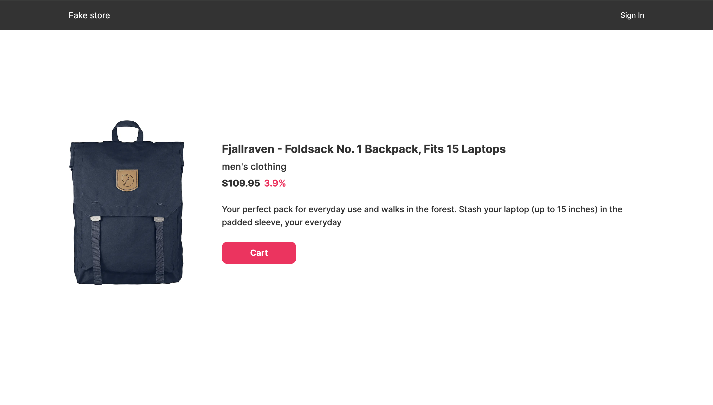
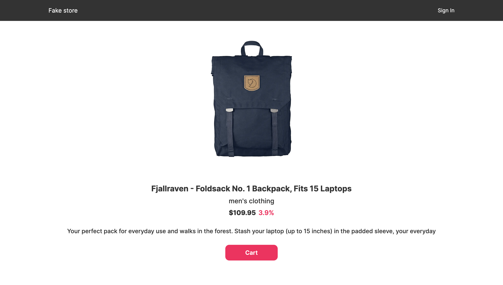
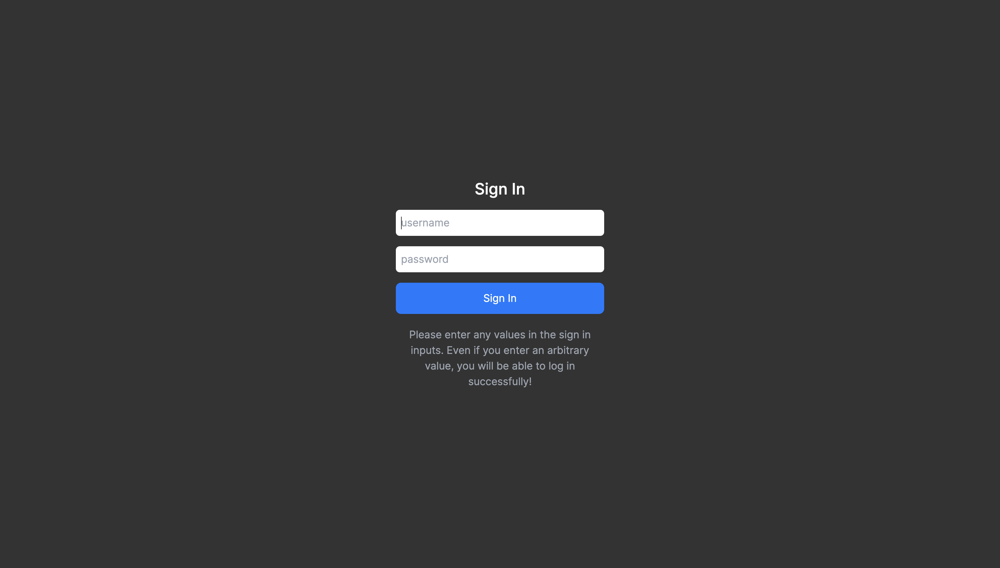
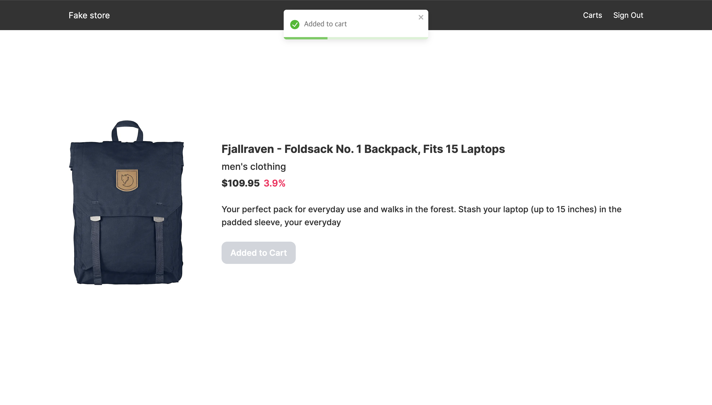
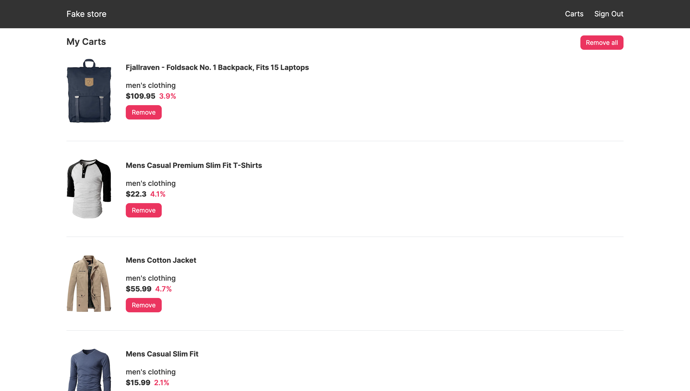
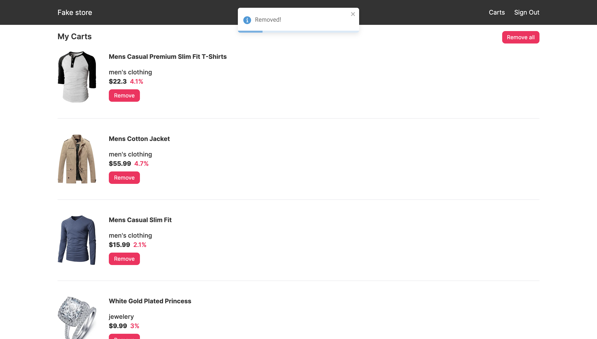
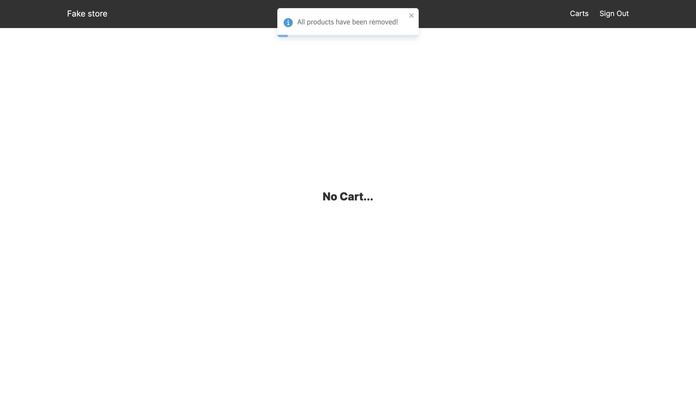

## Fake Store (Shopping Mall Assignment)

fake store api를 이용한 간단한 쇼핑몰 연습 프로젝트입니다. (작업기간: 2일)

배포된 url: https://fake-store-theta-nine.vercel.app/

사용된 api 정보: https://fakestoreapi.com/

## Tech Stack

1. Next.Js (App-router)
2. Typescript
3. Tailwind CSS
4. zustand, zustand-persist
5. React-Query
6. react-hook-form
7. react-toastify
8. framer-motion

## 기능

<ol>
<li>
로그인 

fake store에서 로그인 시 허용되는 usename과 password 값이 있어 그 값을 서버로 전송하여 access token을 받았습니다.

(유저가 input에 어떠한 값을 입력하더라도, 허용된 value들이 서버에 전송됩니다.)

</li>

<li>

모든 상품정보 조회

React-Query의 ssr 설정으로 상품 데이터들을 prefetch 하였습니다.

</li>

<li>

장바구니

장바구니의 아이템들을 배열상태로 만들고, zustand-persist를 이용하여 localStorage에 전역 관리해주었습니다. 장바구니의 배열상태가 변경 될 때마다 컴포넌트에서 useEffect를 이용하여 refetch 하는 것으로 UI를 업데이트 해주고 있습니다.

</li>
</ol>

## home

## detail

## sign-in

## cart에 담았을 때

## carts

## cart 하나 삭제

## cart 전부 삭제

